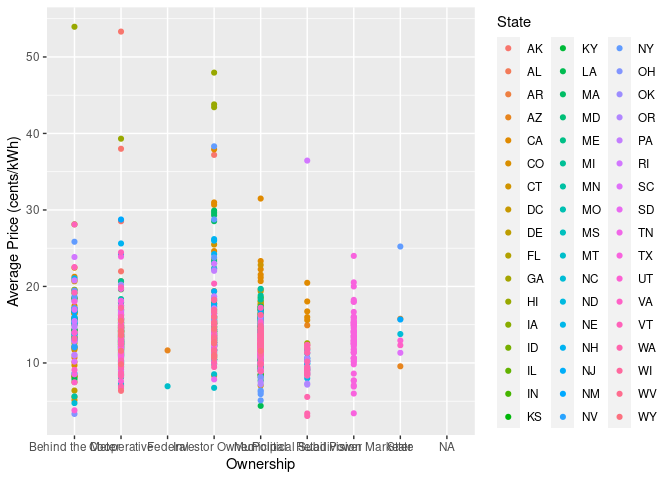

Project proposal
================
Energyyy

``` r
library(tidyverse)
library(broom)
```

## 1. Introduction

The United States of America has on of the most diverse electric grids
in the world. With this many stakeholders it is interesting to know
which factors affect electricity distribution and pricing to what extent
in the US. We are looking into the data from the the U.S. Energy
Information Administration (EIA). EIA collects, analyzes, and
disseminates independent and impartial energy information. The utility
companies are required to self-report this data due to regulations. The
variables that we will be looking at are Ownership type, Customers
(Count), Sales (Megawatt hours) Revenues (Thousands Dollars), and
Average Price (cents/kWh).

Research Question: Which factors affect electricity distribution and
pricing to what extent in the US? - black outs - urban rural - sectors
-seasons - regional differences - utility companies ownership

## 2. Data

``` r
library(readxl)
```

``` r
table_Residential <- read_excel("/cloud/project/data/table_Residential.xlsx",
                                na = c("."))
table_Commercial <- read_excel("/cloud/project/data/table_Commercial.xlsx",
                               na = c("."))
table_Industrial <- read_excel("/cloud/project/data/table_Industrial.xlsx", 
                               na = c("."))
table_Transportation <- read_excel("/cloud/project/data/table_Transportation.xlsx", 
                                   na = c("."))
```

``` r
glimpse(table_Residential)
```

    ## Rows: 1,526
    ## Columns: 7
    ## $ Entity                         <chr> "Alaska Electric Light & Power Co.", "A…
    ## $ State                          <chr> "AK", "AK", "AK", "AK", "AK", "AK", "AK…
    ## $ Ownership                      <chr> "Investor Owned", "Investor Owned", "Co…
    ## $ `Customers (Count)`            <dbl> 15159, 5627, 7770, 96750, 40277, 28994,…
    ## $ `Sales (Megawatthours)`        <dbl> 162982, 26750, 44102, 591397, 282672, 1…
    ## $ `Revenues (Thousands Dollars)` <dbl> 20081.7, 9950.0, 23512.0, 117980.8, 809…
    ## $ `Average Price (cents/kWh)`    <dbl> 12.32142, 37.19626, 53.31278, 19.94951,…

``` r
glimpse(table_Commercial)
```

    ## Rows: 1,535
    ## Columns: 7
    ## $ Entity                         <chr> "Alaska Electric Light & Power Co.", "A…
    ## $ State                          <chr> "AK", "AK", "AK", "AK", "AK", "AK", "AK…
    ## $ Ownership                      <chr> "Investor Owned", "Investor Owned", "Co…
    ## $ `Customers (Count)`            <dbl> 2423, 2662, 3742, 16339, 6835, 4408, 13…
    ## $ `Sales (Megawatthours)`        <dbl> 125095, 46941, 80587, 1247883, 119020, …
    ## $ `Revenues (Thousands Dollars)` <dbl> 13045.9, 13800.0, 36659.8, 195913.5, 32…
    ## $ `Average Price (cents/kWh)`    <dbl> 10.428794, 29.398607, 45.490960, 15.699…

``` r
glimpse(table_Industrial)
```

    ## Rows: 1,245
    ## Columns: 7
    ## $ Entity                         <chr> "Alaska Electric Light & Power Co.", "C…
    ## $ State                          <chr> "AK", "AK", "AK", "AK", "AK", "AK", "AL…
    ## $ Ownership                      <chr> "Investor Owned", "Cooperative", "Coope…
    ## $ `Customers (Count)`            <dbl> 119, 7, 557, 23, 14, 116, 6125, 15, 2, …
    ## $ `Sales (Megawatthours)`        <dbl> 116995, 63345, 842722, 119983, 22801, 8…
    ## $ `Revenues (Thousands Dollars)` <dbl> 13369.2, 8204.0, 169391.8, 14685.5, 226…
    ## $ `Average Price (cents/kWh)`    <dbl> 11.427155, 12.951298, 20.100555, 12.239…

``` r
glimpse(table_Transportation)
```

    ## Rows: 43
    ## Columns: 7
    ## $ Entity                         <chr> "City of North Little Rock - (AR)", "En…
    ## $ State                          <chr> "AR", "AR", "AZ", "AZ", "CA", "CA", "CA…
    ## $ Ownership                      <chr> "Municipal", "Investor Owned", "Politic…
    ## $ `Customers (Count)`            <dbl> 1, 1, 1, 1, 1, 1, 1, 2, 1, 4, 1, 1, 1, …
    ## $ `Sales (Megawatthours)`        <dbl> 213, 6, 9375, 829, 93808, 6968, 909, 10…
    ## $ `Revenues (Thousands Dollars)` <dbl> 33.0, 0.9, 866.0, 115.5, 12338.1, 1322.…
    ## $ `Average Price (cents/kWh)`    <dbl> 15.492958, 15.000000, 9.237333, 13.9324…

This mutate function adds a column which contains the sector of the
data.

``` r
residential <- table_Residential %>%
  mutate(Sector = c("Residential"))
commercial <- table_Commercial %>%
  mutate(Sector = c("Commercial"))
transportation <- table_Transportation %>%
  mutate(Sector = c("Transportation"))
industrial <- table_Industrial %>%
  mutate(Sector = c("Industrial"))
```

This code joins all the tables together. We still need to figure out how
to pivot the data, so that we have a single column called “Sector”.

``` r
energy_sector <- residential %>%
  full_join(commercial, by = "Entity", relationship = "many-to-many") %>%
  full_join(transportation, by = "Entity", relationship = "many-to-many") %>%
  full_join(industrial, by = "Entity", relationship = "many-to-many") #%>%
 # pivot_longer()
#View(energy_sector)
```

## 3. Ethics review

## 4. Data analysis plan

We will use all the mentioned variables in our analyses. There will be
other data that we include in our analysis to visualize the data we
already have, such as coordinates to locate the US states on a potential
heatmap. In case we would like to expand our data analysis, we would go
further into price developments per sector and US state potentially
using data between 1960-2023.

Priority list of data analyses:

1.  Ownership vs price of electricity /according to state

- Q: Does ownership e.g. cooperatives influence the average price of
  electricity, does it benefit individuals/residential sector or is it
  more geared towards commercial sector…?

``` r
ggplot(table_Residential, aes(x = Ownership, y = `Average Price (cents/kWh)`, color = State)) +
  geom_point()
```

    ## Warning: Removed 41 rows containing missing values (`geom_point()`).

<!-- -->

2.  Revenue vs price and actual blackouts and ownership

- Q: does less profit and community owned mean less blackouts? Or does
  ownership tell us that big companies have more means to prevent
  blackouts?
- ggplot(aes(x = avg price, y = revenue, size = n of blackouts/in
  categories)), facet(~ ownership)
- need to add dataset for blackouts

3.  Amount of electricity used, cheaper prices?

- Q: Is it cheaper to buy electricity depending on the sector and is
  buying electricity in bulk cheaper?
- ggplot(aes(x = Sales(mWh)/n of customers, y = average price, color =
  sectors))

4.  Number of customers vs price by sector

- Q: Do bigger utility companies (meaning more customers) offer lower
  avg. prices due to scale?
- ggplot(aes(x = avg price, y = customers)), facet( ~ sector)

5.  Per household consumption of electricity (megawatthours
    sold/customers) vs price

- Q: Do consumers use less electricity if it is more expensive?
- ggplot(aes(x = Sales/customers, y = avg. price))

Stretch goals: 6. Heatmap of the US’ electricity use - Note: we might
need long lat data to map the US states - Average per capita Sales per
state (sum up all sales, group by state, calculate average), each box of
the heatmap is one state

7.  Seasonal price variation vs average temperature, per month

- We would need: avg temperature per month per state, electricity price
  per month for multiple years per state
