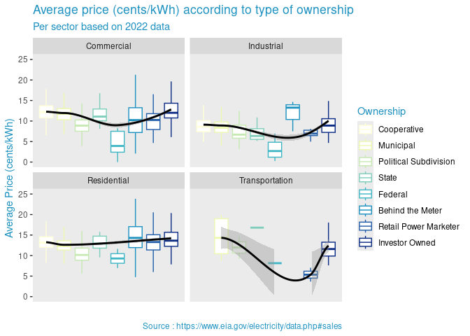

Project Workspace
================
Energyyy

``` r
library(tidyverse)
library(broom)
library(tidyr)
library(readxl)
#install.packages("leaflet")
library(leaflet)
#install.packages("sf")
library(sf)
#install.packages("gganimate")
library(gganimate)
library(ggthemes)
library(gapminder)
```

``` r
table_Residential <- read_excel("/cloud/project/data/table_Residential.xlsx",
                                na = c("."))
table_Commercial <- read_excel("/cloud/project/data/table_Commercial.xlsx",
                               na = c("."))
table_Industrial <- read_excel("/cloud/project/data/table_Industrial.xlsx", 
                               na = c("."))
table_Transportation <- read_excel("/cloud/project/data/table_Transportation.xlsx", 
                                   na = c("."))
table_Disturbance <- read_excel("/cloud/project/data/table_Disturbance.xlsx",
                                na= c(".", ". Hours,  . Minutes", "Unknow", ".        ."))
table_CAIDI <- read_excel("/cloud/project/data/table_CAIDI.xlsx")

USA_df <- sf::st_read("/cloud/project/data/USA_States_Generalized.shp")
```

    ## Reading layer `USA_States_Generalized' from data source 
    ##   `/cloud/project/data/USA_States_Generalized.shp' using driver `ESRI Shapefile'
    ## Simple feature collection with 51 features and 56 fields
    ## Geometry type: MULTIPOLYGON
    ## Dimension:     XY
    ## Bounding box:  xmin: -178.2176 ymin: 18.92179 xmax: -66.96927 ymax: 71.40624
    ## Geodetic CRS:  WGS 84

This mutate function adds a column which contains the sector of the
data.

``` r
USA_df <- USA_df %>%
 rename(`Census Division\r\nand State` = STATE_NAME)
residential <- table_Residential %>%
  mutate(Sector = c("Residential"))
commercial <- table_Commercial %>%
  mutate(Sector = c("Commercial"))
transportation <- table_Transportation %>%
  mutate(Sector = c("Transportation"))
industrial <- table_Industrial %>%
  mutate(Sector = c("Industrial"))
```

This code binds all the tables with sectors together.

``` r
energy_sector <- bind_rows(residential, commercial, industrial, transportation)
```

``` r
table_Disturbance <- table_Disturbance |>
  mutate(Entity = `Utility/Power Pool`)

energy_sector_rev_sum <- energy_sector |> 
  select(Entity, Ownership, `Revenues (Thousands Dollars)`) |>
  group_by(Entity, Ownership) |>
  summarise(sum_revenue = sum(`Revenues (Thousands Dollars)`)) |>
  as.data.frame()
```

    ## `summarise()` has grouped output by 'Entity'. You can override using the
    ## `.groups` argument.

``` r
table_CAIDI <- table_CAIDI |>
  pivot_longer(cols = `2013`:`2022`,
              names_to = "Year",
              values_to = "CAIDI")
```

``` r
our_theme <- theme_grey() + 
  theme(text = element_text(color = "#1d91c0"), 
        legend.text = element_text(color = "black"))
```

## 1. Ownership vs price of electricity /according to sector

- Q: Does ownership e.g. cooperatives influence the average price of
  electricity, does it benefit individuals/residential sector or is it
  more geared towards commercial sector…?\`

``` r
energy_sector |>
  filter(!is.na(Ownership)) |>
  mutate(
    Ownership = fct_relevel(
      Ownership,
      "Cooperative", "Municipal", "Political Subdivision", "State", "Federal", "Behind the Meter", "Retail Power Marketer", "Investor Owned"
    )) |>

 ggplot(aes(x = as.numeric(Ownership), y = `Average Price (cents/kWh)`)) +
  geom_boxplot(outlier.shape = NA, aes(color = Ownership)) +
  geom_smooth(method = "loess", color = "black") +
  ylim(0,25)+
  facet_wrap(~Sector) +
  scale_color_manual(values = c("Cooperative" = "#ffffd9", "Municipal" = "#edf8b1", "Political Subdivision" = "#c7e9b4", "State" = "#7fcdbb", "Federal" = "#41b6c4", "Behind the Meter" = "#1d91c0", "Retail Power Marketer" = "#225ea8", "Investor Owned" = "#0c2c84")) +
  labs(
    title = "Average Price (cents/kWh) according to Type of Ownership",
    subtitle = "Per Sector based on 2022 data",
    caption = "Source : https://www.eia.gov/electricity/data.php#sales",
    x = "") +
  our_theme +
  theme(axis.text.x = element_blank(), 
        axis.ticks.x = element_blank(),
        panel.grid = element_blank())
```

    ## Warning: Removed 73 rows containing non-finite outside the scale range
    ## (`stat_boxplot()`).

    ## `geom_smooth()` using formula = 'y ~ x'

    ## Warning: Removed 73 rows containing non-finite outside the scale range
    ## (`stat_smooth()`).

    ## Warning in simpleLoess(y, x, w, span, degree = degree, parametric = parametric,
    ## : pseudoinverse used at 0.965

    ## Warning in simpleLoess(y, x, w, span, degree = degree, parametric = parametric,
    ## : neighborhood radius 2.035

    ## Warning in simpleLoess(y, x, w, span, degree = degree, parametric = parametric,
    ## : reciprocal condition number 2.0707e-15

    ## Warning in simpleLoess(y, x, w, span, degree = degree, parametric = parametric,
    ## : There are other near singularities as well. 4

    ## Warning in predLoess(object$y, object$x, newx = if (is.null(newdata)) object$x
    ## else if (is.data.frame(newdata))
    ## as.matrix(model.frame(delete.response(terms(object)), : pseudoinverse used at
    ## 0.965

    ## Warning in predLoess(object$y, object$x, newx = if (is.null(newdata)) object$x
    ## else if (is.data.frame(newdata))
    ## as.matrix(model.frame(delete.response(terms(object)), : neighborhood radius
    ## 2.035

    ## Warning in predLoess(object$y, object$x, newx = if (is.null(newdata)) object$x
    ## else if (is.data.frame(newdata))
    ## as.matrix(model.frame(delete.response(terms(object)), : reciprocal condition
    ## number 2.0707e-15

    ## Warning in predLoess(object$y, object$x, newx = if (is.null(newdata)) object$x
    ## else if (is.data.frame(newdata))
    ## as.matrix(model.frame(delete.response(terms(object)), : There are other near
    ## singularities as well. 4

    ## Warning in simpleLoess(y, x, w, span, degree = degree, parametric = parametric,
    ## : pseudoinverse used at 0.965

    ## Warning in simpleLoess(y, x, w, span, degree = degree, parametric = parametric,
    ## : neighborhood radius 1.035

    ## Warning in simpleLoess(y, x, w, span, degree = degree, parametric = parametric,
    ## : reciprocal condition number 3.052e-29

    ## Warning in simpleLoess(y, x, w, span, degree = degree, parametric = parametric,
    ## : There are other near singularities as well. 1

    ## Warning in predLoess(object$y, object$x, newx = if (is.null(newdata)) object$x
    ## else if (is.data.frame(newdata))
    ## as.matrix(model.frame(delete.response(terms(object)), : pseudoinverse used at
    ## 0.965

    ## Warning in predLoess(object$y, object$x, newx = if (is.null(newdata)) object$x
    ## else if (is.data.frame(newdata))
    ## as.matrix(model.frame(delete.response(terms(object)), : neighborhood radius
    ## 1.035

    ## Warning in predLoess(object$y, object$x, newx = if (is.null(newdata)) object$x
    ## else if (is.data.frame(newdata))
    ## as.matrix(model.frame(delete.response(terms(object)), : reciprocal condition
    ## number 3.052e-29

    ## Warning in predLoess(object$y, object$x, newx = if (is.null(newdata)) object$x
    ## else if (is.data.frame(newdata))
    ## as.matrix(model.frame(delete.response(terms(object)), : There are other near
    ## singularities as well. 1

    ## Warning in simpleLoess(y, x, w, span, degree = degree, parametric = parametric,
    ## : pseudoinverse used at 0.965

    ## Warning in simpleLoess(y, x, w, span, degree = degree, parametric = parametric,
    ## : neighborhood radius 2.035

    ## Warning in simpleLoess(y, x, w, span, degree = degree, parametric = parametric,
    ## : reciprocal condition number 2.7653e-15

    ## Warning in simpleLoess(y, x, w, span, degree = degree, parametric = parametric,
    ## : There are other near singularities as well. 4

    ## Warning in predLoess(object$y, object$x, newx = if (is.null(newdata)) object$x
    ## else if (is.data.frame(newdata))
    ## as.matrix(model.frame(delete.response(terms(object)), : pseudoinverse used at
    ## 0.965

    ## Warning in predLoess(object$y, object$x, newx = if (is.null(newdata)) object$x
    ## else if (is.data.frame(newdata))
    ## as.matrix(model.frame(delete.response(terms(object)), : neighborhood radius
    ## 2.035

    ## Warning in predLoess(object$y, object$x, newx = if (is.null(newdata)) object$x
    ## else if (is.data.frame(newdata))
    ## as.matrix(model.frame(delete.response(terms(object)), : reciprocal condition
    ## number 2.7653e-15

    ## Warning in predLoess(object$y, object$x, newx = if (is.null(newdata)) object$x
    ## else if (is.data.frame(newdata))
    ## as.matrix(model.frame(delete.response(terms(object)), : There are other near
    ## singularities as well. 4

    ## Warning in simpleLoess(y, x, w, span, degree = degree, parametric = parametric,
    ## : pseudoinverse used at 8.03

    ## Warning in simpleLoess(y, x, w, span, degree = degree, parametric = parametric,
    ## : neighborhood radius 3.03

    ## Warning in simpleLoess(y, x, w, span, degree = degree, parametric = parametric,
    ## : reciprocal condition number 0

    ## Warning in simpleLoess(y, x, w, span, degree = degree, parametric = parametric,
    ## : There are other near singularities as well. 4

    ## Warning in predLoess(object$y, object$x, newx = if (is.null(newdata)) object$x
    ## else if (is.data.frame(newdata))
    ## as.matrix(model.frame(delete.response(terms(object)), : pseudoinverse used at
    ## 8.03

    ## Warning in predLoess(object$y, object$x, newx = if (is.null(newdata)) object$x
    ## else if (is.data.frame(newdata))
    ## as.matrix(model.frame(delete.response(terms(object)), : neighborhood radius
    ## 3.03

    ## Warning in predLoess(object$y, object$x, newx = if (is.null(newdata)) object$x
    ## else if (is.data.frame(newdata))
    ## as.matrix(model.frame(delete.response(terms(object)), : reciprocal condition
    ## number 0

    ## Warning in predLoess(object$y, object$x, newx = if (is.null(newdata)) object$x
    ## else if (is.data.frame(newdata))
    ## as.matrix(model.frame(delete.response(terms(object)), : There are other near
    ## singularities as well. 4



``` r
#ggsave(filename = "Ownership vs price.png", device = "png")
```

# 2a. Revenue and actual blackouts and ownership

- Q: does less profit and community owned mean less blackouts? Or does
  ownership tell us that big companies have more means to prevent
  blackouts?

``` r
disturbance_count <- table_Disturbance |>
  group_by(Entity) |>
  count()

disturbance_complete <- disturbance_count |> 
  inner_join(energy_sector_rev_sum)
```

    ## Joining with `by = join_by(Entity)`

For the next plot we want to count the disturbances per utility company.

``` r
ggplot(disturbance_complete, aes(
  y = sum_revenue/1000000, 
  x = `Ownership`,
  size = n)) +
  geom_point(color = "#1d91c0", alpha = 0.8) +
  labs(title = "Number of Disturbances per Utility Company", 
       subtitle = "in relation to Ownership Type and Revenue", 
       x = "Type of Ownership", y = "Revenue in Million Dollars ($)", 
       size = "Number of\nDisturbances",
       caption = "Source : https://www.eia.gov/electricity/data.php#sales") +
  our_theme
```


# 2b. CAIDI reliability in electricity networks throughout the US based on states

Q: How does CAIDI vary throughout the US states?

``` r
#Data contains states and regions. Thus, we filter for states only.
table_CAIDI <- table_CAIDI %>%
  filter(`Census Division\r\nand State` %in% c(
  "Alabama", "Alaska", "Arizona", "Arkansas", "California", "Colorado", "Connecticut", "Delaware", "Florida", "Georgia", "Hawaii", "Idaho", "Illinois", "Indiana", "Iowa", "Kansas", "Kentucky", "Louisiana", "Maine", "Maryland", "Massachusetts", "Michigan", "Minnesota", "Mississippi", "Missouri", "Montana", "Nebraska", "Nevada", "New Hampshire", "New Jersey", "New Mexico", "New York", "North Carolina", "North Dakota", "Ohio", "Oklahoma", "Oregon", "Pennsylvania", "Rhode Island", "South Carolina",  "South Dakota", "Tennessee", "Texas", "Utah", "Vermont", "Virginia", "Washington", "West Virginia", "Wisconsin", "Wyoming", "Illinois", "Montana", "District of Columbia"))

USA_df <- USA_df %>%
  select("Census Division\r\nand State")
```

``` r
CAIDI_leaflet_df <- 
  merge(USA_df, table_CAIDI, by = "Census Division\r\nand State")

CAIDI_leaflet_df <- CAIDI_leaflet_df %>%
  filter(`Major Event Days` == FALSE)
```

``` r
CAIDI_2013 <- CAIDI_leaflet_df |>
  filter(Year == "2013")
###
CAIDI_2014 <- CAIDI_leaflet_df |>
  filter(Year == "2014")
###
CAIDI_2015 <- CAIDI_leaflet_df |>
  filter(Year == "2015")
###
CAIDI_2016 <- CAIDI_leaflet_df |>
  filter(Year == "2016")
###
CAIDI_2017 <- CAIDI_leaflet_df |>
  filter(Year == "2017")
###
CAIDI_2018 <- CAIDI_leaflet_df |>
  filter(Year == "2018")
###
CAIDI_2019 <- CAIDI_leaflet_df |>
  filter(Year == "2019")
###
CAIDI_2020 <- CAIDI_leaflet_df |>
  filter(Year == "2022")
###
CAIDI_2021 <- CAIDI_leaflet_df |>
  filter(Year == "2021")
###
CAIDI_2022 <- CAIDI_leaflet_df |>
  filter(Year == "2022")
```

``` r
CAIDI_leaflet_df %>%
  summary("CAIDI") #to determine bin size
```

    ##  Census Division\r\nand State Major Event Days     Year          
    ##  Length:510                   Mode :logical    Length:510        
    ##  Class :character             FALSE:510        Class :character  
    ##  Mode  :character                              Mode  :character  
    ##                                                                  
    ##                                                                  
    ##                                                                  
    ##      CAIDI                 geometry  
    ##  Min.   : 26.10   MULTIPOLYGON :510  
    ##  1st Qu.: 96.42   epsg:4326    :  0  
    ##  Median :109.30   +proj=long...:  0  
    ##  Mean   :112.12                      
    ##  3rd Qu.:123.42                      
    ##  Max.   :244.40

``` r
bins <- seq(from = 26, to = 245, by = 25)

palCAIDI <- colorBin("OrRd", domain = CAIDI_leaflet_df$CAIDI, bins = bins, alpha = TRUE)
```

``` r
labels_2013 <- sprintf("<strong>%s</strong><br/>%g", 
                  CAIDI_2013$`Census Division\r\nand State`, CAIDI_2013$CAIDI) %>% lapply(htmltools::HTML)

labels_2014 <- sprintf("<strong>%s</strong><br/>%g", 
                  CAIDI_2014$`Census Division\r\nand State`, CAIDI_2014$CAIDI) %>% lapply(htmltools::HTML)

labels_2015 <- sprintf("<strong>%s</strong><br/>%g", 
                  CAIDI_2015$`Census Division\r\nand State`, CAIDI_2015$CAIDI) %>% lapply(htmltools::HTML)

labels_2016 <- sprintf("<strong>%s</strong><br/>%g", 
                  CAIDI_2016$`Census Division\r\nand State`, CAIDI_2016$CAIDI) %>% lapply(htmltools::HTML)

labels_2017 <- sprintf("<strong>%s</strong><br/>%g", 
                  CAIDI_2017$`Census Division\r\nand State`, CAIDI_2017$CAIDI) %>% lapply(htmltools::HTML)

labels_2018 <- sprintf("<strong>%s</strong><br/>%g", 
                  CAIDI_2018$`Census Division\r\nand State`, CAIDI_2018$CAIDI) %>% lapply(htmltools::HTML)

labels_2019 <- sprintf("<strong>%s</strong><br/>%g", 
                  CAIDI_2019$`Census Division\r\nand State`, CAIDI_2019$CAIDI) %>% lapply(htmltools::HTML)

labels_2020 <- sprintf("<strong>%s</strong><br/>%g", 
                  CAIDI_2020$`Census Division\r\nand State`, CAIDI_2020$CAIDI) %>% lapply(htmltools::HTML)

labels_2021 <- sprintf("<strong>%s</strong><br/>%g", 
                  CAIDI_2021$`Census Division\r\nand State`, CAIDI_2021$CAIDI) %>% lapply(htmltools::HTML)

labels_2022 <- sprintf("<strong>%s</strong><br/>%g", 
                  CAIDI_2022$`Census Division\r\nand State`, CAIDI_2022$CAIDI) %>% lapply(htmltools::HTML)
```

``` r
leaflet() %>%
  addTiles() %>%
  setView(lng = -98.6,
          lat = 36.7,
          zoom = 4) %>%
  addPolygons(data = CAIDI_2013, 
              group = "2013",
              fillColor = ~palCAIDI(CAIDI_2013$CAIDI), 
              color = "white", 
              label = labels_2013) %>%
   addPolygons(data = CAIDI_2014, 
              group = "2014",
              fillColor = ~palCAIDI(CAIDI_2014$CAIDI), 
              color = "white", 
              label = labels_2014) %>%
   addPolygons(data = CAIDI_2015, 
              group = "2015",
              fillColor = ~palCAIDI(CAIDI_2015$CAIDI), 
              color = "white", 
              label = labels_2015) %>%
   addPolygons(data = CAIDI_2016, 
              group = "2016",
              fillColor = ~palCAIDI(CAIDI_2016$CAIDI), 
              color = "white", 
              label = labels_2016) %>%
  addPolygons(data = CAIDI_2017, 
              group = "2017",
              fillColor = ~palCAIDI(CAIDI_2017$CAIDI), 
              color = "white", 
              label = labels_2017) %>%
   addPolygons(data = CAIDI_2018, 
              group = "2018",
              fillColor = ~palCAIDI(CAIDI_2018$CAIDI), 
              color = "white", 
              label = labels_2018) %>%
   addPolygons(data = CAIDI_2019, 
              group = "2019",
              fillColor = ~palCAIDI(CAIDI_2019$CAIDI), 
              color = "white", 
              label = labels_2019) %>%
   addPolygons(data = CAIDI_2020, 
              group = "2020",
              fillColor = ~palCAIDI(CAIDI_2020$CAIDI), 
              color = "white", 
              label = labels_2020) %>%
   addPolygons(data = CAIDI_2021, 
              group = "2021",
              fillColor = ~palCAIDI(CAIDI_2021$CAIDI), 
              color = "white", 
              label = labels_2021) %>%
  addPolygons(data = CAIDI_2022, 
              group = "2022",
              fillColor = ~palCAIDI(CAIDI_2022$CAIDI), 
              color = "white", 
              label = labels_2022) %>%
  addLayersControl(
    baseGroups = c("2013", "2014", "2015", "2016", "2017","2018","2019", "2020", "2021", "2022"),
    options = layersControlOptions(collapsed = TRUE)
  ) %>%
  addLegend(
    position = "bottomright",
    pal = palCAIDI,
    values = CAIDI_leaflet_df$CAIDI,
    title = "Customer Average\nInterruption Duration\nIndex",
    opacity = 1)
```

``` r
# Create a base plot
CAIDI_leaflet_df$Year <-as.numeric(CAIDI_leaflet_df$Year)

p <- CAIDI_leaflet_df |>
  ggplot(aes(fill = CAIDI,
             group = Year)) +
  geom_sf() +
  xlim(125, 68) +
  ylim(24.5, 50) +
  scale_fill_viridis_c() +
  our_theme +
  theme(axis.text.x = element_blank(), 
        axis.ticks.x = element_blank(),
        axis.text.y = element_blank(), 
        axis.ticks.y = element_blank(),
        panel.grid = element_blank(),
        panel.background = element_rect(fill='white')) +
  labs(title = "Customer Average Interruption Duration Index (CAIDI) map of lower 48 US states", 
       subtitle = "Year: {closest_state}",
       caption = "Source: https://www.eia.gov/electricity/data/annual/") 

# Create an animated plot
p <- p + transition_states(
  states = Year,
  transition_length = 3,
  state_length = 3)

#animate(p, duration = 30, renderer = gifski_renderer("map.gif"))
```

## 3. Amount of electricity used, cheaper prices?

- Q: Is it cheaper to buy electricity depending on the sector? Is buying
  electricity in bulk cheaper?

- compare this to experience in history: companies that consume lots of
  electricity usually get cheaper electricity prices because utilities
  had reliable demand from the industries

- electricity producers want reliable consumers –\> does this bias still
  exist? Book: “The Grid”

``` r
#creating the mean of average price in each sector
line_test <- energy_sector |>
  summarise(mean(`Average Price (cents/kWh)`, na.rm = TRUE),.by = Sector)

line_test$mean <- line_test$`mean(\`Average Price (cents/kWh)\`, na.rm = TRUE)` 

line_test$label <-
  round(line_test$mean, 2)

#create graph using mean of average price in each sector
energy_sector |>
  ggplot(aes(x = (
    `Sales (Megawatthours)`*1000/`Customers (Count)`), y = `Average Price (cents/kWh)`, color = Sector)) +
  geom_point() +
  geom_smooth() +
  geom_hline(data = line_test, aes(yintercept = mean)) +
  geom_text(data = line_test, aes(50000000, y = label, label = label, vjust = -1), color = "black") +
  facet_wrap(~Sector) +
  scale_color_viridis_d() +
  xlim(0, 400000000) +
  labs(
    title = "Average KWh Consumption per Customer vs Average Price",
    subtitle = "by Sector in 2022",
    x = "Average kWh Consumption per Customer",
    y = "Average Price (cents/kWh)",
    caption = "Source : https://www.eia.gov/electricity/data.php#sales"
  ) +
  our_theme +
  theme(panel.grid = element_blank())
```

    ## `geom_smooth()` using method = 'gam' and formula = 'y ~ s(x, bs = "cs")'

    ## Warning: Removed 145 rows containing non-finite outside the scale range
    ## (`stat_smooth()`).

    ## Warning: Removed 145 rows containing missing values or values outside the scale range
    ## (`geom_point()`).


## 4. Number of customers vs price by sector

- Q: Do bigger utility companies (meaning more customers) offer lower
  avg. prices due to scale?

``` r
energy_sector |>
  filter(Sector == "Residential") |>
  ggplot(aes(x = `Customers (Count)`, y = `Average Price (cents/kWh)`)) +
  geom_point() +
  geom_smooth() +
  xlim(0, 250000) +
  labs(title = "Average Price vs. Number of Customers", 
       subtitle = "per Utility company for the Residential Sector in 2022", 
       x = "Number of Customers", 
       y = "Average Price (cents/kWh)",
       caption = "Source : https://www.eia.gov/electricity/data.php#sales") +
  our_theme
```

    ## `geom_smooth()` using method = 'gam' and formula = 'y ~ s(x, bs = "cs")'

    ## Warning: Removed 149 rows containing non-finite outside the scale range
    ## (`stat_smooth()`).

    ## Warning: Removed 149 rows containing missing values or values outside the scale range
    ## (`geom_point()`).


## 5. Per household consumption of electricity (megawatthours sold/customers) vs price

- Q: Do consumers use less electricity if it is more expensive?

``` r
ggplot(table_Residential, aes(x = (`Sales (Megawatthours)`*1000)/`Customers (Count)`, y = `Average Price (cents/kWh)`)) +
  geom_hex() +
  geom_smooth() +
  labs(title = "Electricity Consumption per Customer vs. Average Price", 
       subtitle = "in the Residential Sector in 2022", 
       x = "Average Electricity Consumption per Customer (in kWh)", 
       y = "Average Price (cents/kWh)", 
       fill = "Number of\nUtility\nCompanies",
       caption = "Source : https://www.eia.gov/electricity/data.php#sales") +
  our_theme
```

    ## Warning: Removed 41 rows containing non-finite outside the scale range
    ## (`stat_binhex()`).

    ## `geom_smooth()` using method = 'gam' and formula = 'y ~ s(x, bs = "cs")'

    ## Warning: Removed 41 rows containing non-finite outside the scale range
    ## (`stat_smooth()`).


